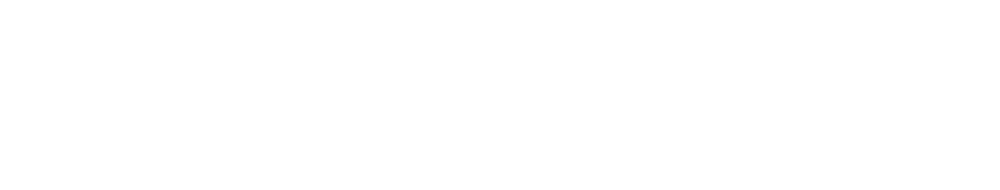

# UNSW Discord Verification Bot

This is a simple and secure email-based verification bot for UNSW students and staff, hosted for free by the UNSW Security Society.
It is designed to be as simple as possible to implement in any UNSW society as quickly as possible.
See images of the verification process in `images` folder.

## Setup
1. Create a server role called `verified` which grants users access to server channels
2. Create an admin-only `#verification-logs` text channel
3. Create a `#verify` text channel
4. Invite the discord bot to the server and grant requested permissions ([secso.cc/verificationbot](http://secso.cc/verificationbot))
5. Run `/send-verify-button` in `#verify`
5. Profit!?

Once these steps are complete users will be able to verify by clicking the `Verify Email` button.

### Important notes:
The bot user role must be higher in the hierarchy than the `verified` role in server settings. \
The `verification-logs` channel should only be accessible by a few trusted members of the society's executive team to protect user privacy. \
The `verify` channel should be the only channel accessible to an unverified discord user. It doesn't need to be called 'verify'. \
Also, remove all permissions from `@everyone`. They will still be able to use the verification button.

## Backups
SecSoc does not guarantee the availability of backups for all societies so we reccommend regularly utilising the `/export` (admin only) command and maintain backups for your own society. If issues arise, contact `projects@unswsecurity.com` or for general problems, raise an issue on this GitHub repository.

## Migration
In order to migrate existing verified discord members to this verification bot, you will need to `/import` a CSV in the following format:

```csv
discord_id,email,verified,verified_at
123456789123456789,person1@ad.unsw.edu.au,1,
234567892345678923,person2@ad.unsw.edu.au,1,
```

Every row must contain at least a `discord_id` and `email`. If `verified` is omitted it will default to 0 (false). Optionally, you may also add an informational `verified_at` value which stores the time of verification in unix seconds.

You may find it useful to utilise a Python script to migrate your current configuration to a CSV. Feel free to contact `projects@unswsecurity.com` for help.

## Why this bot
At the time of writing, this bot provides many benefits over other bots with the same aim:
- No passwords are ever transmitted or stored
- Open source implementation
- Supported by a UNSW SecSoc as compared to individual developers who may stop maintaining their projects
- Ability for societies to manage their own backups
- No dependencies on other small projects
- Verification emails don't get marked as junk mail by UNSW
- Easily self-hostable via [Docker Hub image](https://hub.docker.com/repository/docker/unswsecsoc/unsw-discord-verification-bot)
- Easy to migrate from existing verification solutions
- Support from SecSoc Projects team if issues arise
- Extremely fast setup
- Highly documented for developers

## Contributing
Any PRs, suggestions or issues raised will be attended to by the UNSW SecSoc Projects team. 
Feel free to create a pull request to fix typos, add features or improve performance if you wish and they will be reviewed and accepted if they are likely to prove useful for all societies.
You can find a system flowchart here: [SecSoc Discord Verification.drawio.pdf](/SecSoc%20Discord%20Verification.drawio.pdf).
